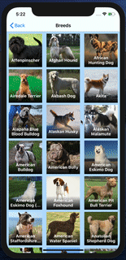
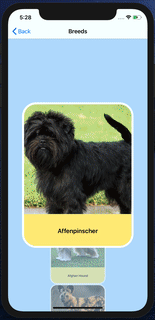
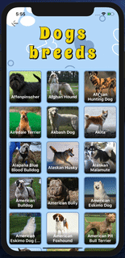
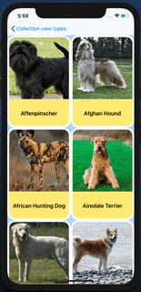
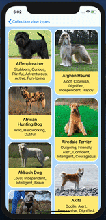

# Dogs-breeds
## Краткое описание:
Данное приложение написано для визуального примера разных подходов формирования UICollectionView. В качестве данных взята часть базы данных сайта https://thedogapi.com, который предоставляет бесплатно перечень пород собак, фотографии и краткое описание каждой. Приложение отображает список возможных типов коллекций (первый экран). По нажатию на тип, открывается коллеция, которая отображает перечень пород. По нажатию на ячейку, отображается детальное описание попроды с увеличенным изображением.

## Архитектура
Приложение написано с использованием архитектуры 'Clean Swift'. Каждый модуль - атомарная единица и может быть легко перенесен, как в рамках данного приложения, так и в другие проекты. Каждый модуль состоит из:
* Model - модель, включающая в себя энумы, для "общения" компонентов модуля между собой
* View - класс взаимодействия с пользователем (отображение данных, реакция на поведение)
* Presenter - класс, отвечающий за подготовку данных для отображения
* Interactor - класс, отвечающий за бизнес логику приложения
* Router - класс, предоставляющий логику подготовки и реализации навигации из модуля в модуль

## Верстка
Вся верстка в приложении выполнена без использования сторибордов и ксибов, кодом.

## Получение данных
Для упрощения, данные являются статичными и лежать в самом проекте в файле breeds.json. Парсинг проивзодится посредством Codable структур.

## Описание типов коллекций:
### Классический
Обычное отображение данных в ячейках с возможностью перехода к детальному просмотру.

### Карусель
Анимированное отображение ячейки с изменением размеров и прозрачности при скролле.

### Растягивающаяся "шапка" коллекции 
Популярное решение с увеличением шапки коллекции при попытке ее обновить. 

### Настравиемый вывод потока (CustomFlowLayout)
Реализация вывода потока согласно расчетам элементов ячейки.

### Мозаика
Улучшенная версия вывода потока для реализации подобия популярного приложения.

